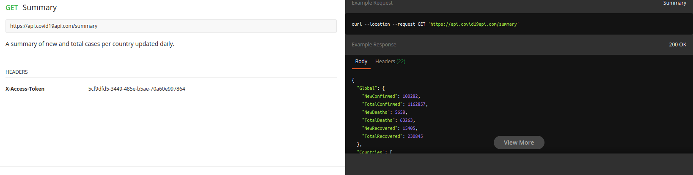
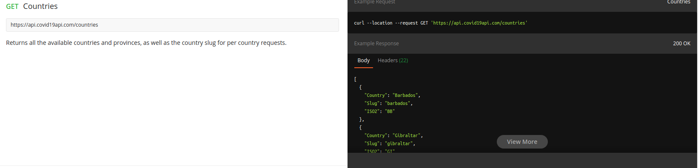
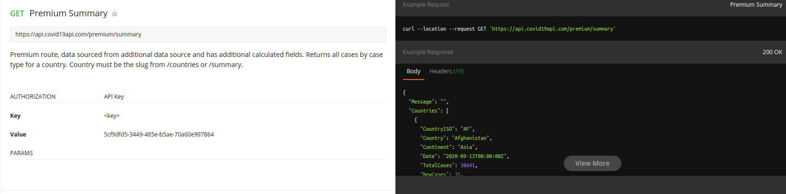

# Tesztjegyzőkönyv

Tesztelendő program
-------------------
**com.null.covid19_tracker** nevű android alkalmazás

Tesztelési környezet
--------------------

Mivel android alkalmazásról van szó ezért unit és integration tesztek kevesebbek, mint a manuális tesztek száma. Mivel java / kotlin / android környezetre nincs automatizált screen propagation / gesture propagation alkalmazás / könyvtár ezért a további teszteket saját kezüleg kell elvégezni.

Tesztelés tárgya
----------------

Alkalmazás megfeleől működése, backend és 'frontend' meglefelő szinkronizációja és kapott adatok, rendses feldolgozása és megjelenítése.

Tesztelés célja
---------------

Rossz funkcionalitás, esetleges rossz kalkuláció, route és logic hiba kiszűrése.

Backend postman-es tesztelése
-----------------------------
Postman API request tesztelőt a következő linken lehet letölteni: [Postman](https://www.postman.com/)

Tesztelők
---------

#### Raska Gergely
**Unit és integration tesztek**

- Teszt 1: MainActivity.kt renszeresen frissít-e a megfelelő adatokkal.
- Teszt 2: MapActivity.kt körök nagysága megfelelő-e
- Teszt 3:

#### Mester Ákos
**Unit és integration tesztek**

- Teszt 1: MainActivity.kt renszeresen frissít-e a megfelelő adatokkal.
- Teszt 2: MapActivity.kt körök nagysága megfelelő-e
- Teszt 3:

#### Boda Zsolt
**Unit és Manuális tesztek**

- Teszt 1: MainActivity.kt renszeresen frissít-e a megfelelő adatokkal.
- Teszt 2: MapActivity.kt körök nagysága megfelelő-e
- Teszt 3: